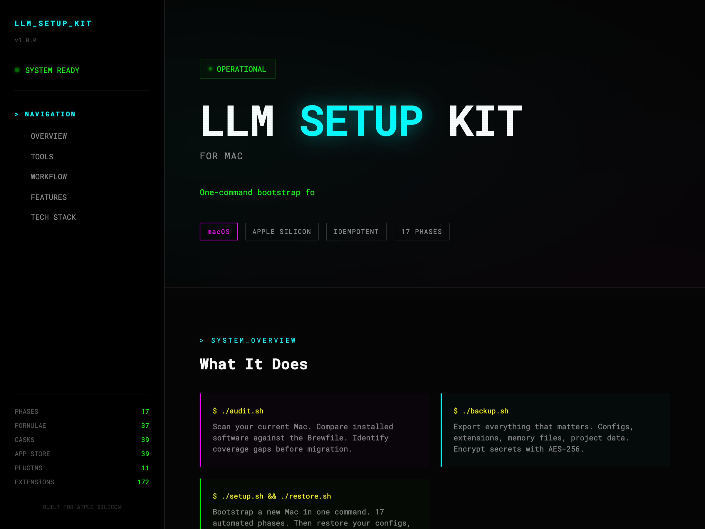

# LLM-Setup-Kit-for-Mac

**One-command bootstrap + full migration kit for local LLM development on macOS (Apple Silicon)**


Goes beyond dotfiles — 17-phase automated setup, config backup/restore with encrypted secrets, pre-migration audit, and post-setup verification.

**[View the live site](https://parsamivehchi.github.io/LLM-Setup-Kit-for-Mac/)**

<p align="center">
  <a href="https://parsamivehchi.github.io/llm-setup-kit-for-mac/">
    
  </a>
</p>

---

## Quick Start

```bash
git clone https://github.com/parsamivehchi/LLM-Setup-Kit-for-Mac.git ~/mac-setup
cd ~/mac-setup
./setup.sh
```

Preview without making changes:

```bash
./setup.sh --dry-run
```

## The Toolkit

| Script | Purpose |
|--------|---------|
| `audit.sh` | Pre-migration readiness scan — 12 sections comparing installed state vs Brewfile |
| `backup.sh` | Export configs, data, and AES-256 encrypted secrets |
| `setup.sh` | 17-phase idempotent bootstrap (`--dry-run`, `--skip-restore`) |
| `restore.sh` | Restore from backup with SHA-256 manifest verification |
| `tests/verify.sh` | Automated post-setup checks (30+ CLI tools, 10+ apps) |
| `Brewfile` | Full system inventory: 37 formulae, 39 casks, 39 App Store apps |

## What Gets Installed

### CLI Tools
git, gh, bat, eza, fzf, ripgrep, fd, jq, yq, htop, btop, tmux, stow, starship, zoxide, mas, deno, ffmpeg, lazygit, ncdu, pandoc, yt-dlp, gnupg, pipx

### Languages & Runtimes
- Python 3.12 + uv (package manager)
- Node.js + Bun (JS runtime)
- Deno (JS/TS runtime)

### LLM Tooling
- **Ollama** — local model runner with LaunchAgent for background service
- **Claude Code** — Anthropic's CLI agent (11 plugins, memory, settings)
- Pre-pulled models: qwen3-coder, qwen2.5-coder:14b, deepseek-r1:14b, llama3.2:3b, nomic-embed-text

### Applications (115 total)
- **Casks**: Ghostty, Cursor, VS Code, Docker, Raycast, Arc, Spotify, VLC, Stats, Brave, ChatGPT, Claude, IINA, and more
- **App Store**: Bitwarden, Microsoft Office suite, WhatsApp, Telegram, NordVPN, Amphetamine, Perplexity, and more

### Configuration
- Zsh with starship prompt, zoxide, aliases
- Ghostty terminal (JetBrains Mono, dark theme)
- macOS defaults (Dock, Finder, keyboard, screenshots)
- Git + SSH key generation
- Ollama LaunchAgent

## Setup Phases

| # | Phase | Type |
|---|-------|------|
| 1 | Xcode CLI Tools | core |
| 2 | Homebrew | core |
| 3 | Brew Bundle (115 packages) | core |
| 4 | Mac App Store verification | core |
| 5 | Claude Code | dev |
| 6 | uv | dev |
| 7 | Bun | dev |
| 8 | Ollama Models | llm |
| 9 | Git + SSH | config |
| 10 | macOS Defaults | config |
| 11 | Symlink Configs | config |
| 12 | Claude Code config restore | restore |
| 13 | Editor settings restore | restore |
| 14 | Raycast prefs restore | restore |
| 15 | Project data restore | restore |
| 16 | Manual app checklist | verify |
| 17 | Verification | verify |

## Migration Workflow

### On your OLD Mac:

```bash
cd ~/mac-setup
./audit.sh                    # 1. Scan current state, review report
./backup.sh                   # 2. Export configs, data, encrypted secrets
git add -A && git commit      # 3. Commit updated configs
git push                      # 4. Push to GitHub
# Transfer backups/ to new Mac via AirDrop (contains secrets — never push to git)
```

### On your NEW Mac:

```bash
git clone <repo> ~/mac-setup
# Copy backups/ folder from old Mac into ~/mac-setup/backups/
./setup.sh                    # 5. Bootstrap (17 phases)
./restore.sh backups/<ts>     # 6. Restore configs, data, secrets
./tests/verify.sh             # 7. Automated checks
# Walk through tests/checklist.md for manual verification
```

## What Gets Backed Up

- **Claude Code**: settings, plugins metadata, memory files across all projects
- **VS Code**: extension list (86), settings, snippets
- **Cursor**: extension list (86), settings, keybindings, snippets
- **Raycast**: preferences plist
- **Project data**: tps.sh (LLM-BENCH) artifacts (data, reports, comparison site)
- **Secrets**: .env files + SSH keys (AES-256 encrypted)
- **System**: brew dump, mas list, app inventory, dock/finder plists

## Structure

```
mac-setup/
  setup.sh                    17-phase bootstrap
  audit.sh                    Pre-migration audit
  backup.sh                   Config/data/secrets export
  restore.sh                  Restore from backup
  Brewfile                    115 packages (formulae + casks + mas)
  docs/index.html             GitHub Pages site
  config/
    claude/                   Claude Code settings snapshot
    vscode/                   VS Code extension list + settings
    cursor/                   Cursor extension list + settings
    ghostty/config            Terminal emulator
    starship.toml             Prompt theme
    zshrc                     Shell configuration
    ollama.env                Ollama environment
  scripts/
    restore_claude.sh         Restore Claude Code config
    restore_editors.sh        Restore VS Code + Cursor
    restore_raycast.sh        Restore Raycast prefs
    pull_models.sh            Download Ollama models
    git_config.sh             Git identity + SSH
    macos_defaults.sh         macOS preferences
  tests/
    verify.sh                 Automated post-setup checks
    checklist.md              Manual verification items
  LaunchAgents/
    com.user.ollama.plist     Ollama background service
  backups/                    (gitignored) timestamped backups
```

## Requirements

- macOS 13+ (Apple Silicon recommended)
- Internet connection
- Admin privileges (Homebrew, macOS defaults)
- App Store sign-in (for mas apps)

## Related

**[tps.sh](https://tps.sh)** — Tokens Per Second LLM benchmark built on this setup. 7 models, 147 tests, 21 prompts comparing Ollama and Claude API on Apple Silicon.
